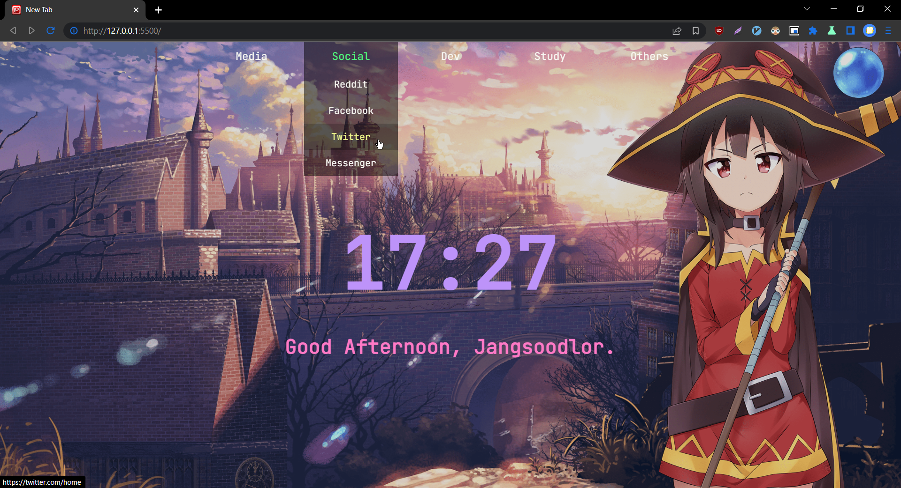

# Jangsoodlor's Personal Start Page

## What is this?
This is a startpage that I've been using for over 2 years now. Forked from and based on [grtcdr/linen](https://github.com/grtcdr/linen) with few tweaks here and there.

## Main Features
- Really Quick access to your favorite websites.
- **HUGE** 24-hrs clock in case someone asks "What time is it?"
- [Megumin](https://myanimelist.net/character/117225/Megumin) background out-of-the-box because Everyone loves Megumin so you should too!

## Customisation

### Want to change the links? 
- They're inside `index.html`. You should be able to modify it to suit your own needs if you observe the general pattern of the code.

### Want your username to display next to the greeting? Or you can't stand the 24hrs format?
- Go to `script.js` and configure it.

### Want to change color pallettes?
- Go inside `style.css`. More instructions are provided there. I have the `themes.txt` for you to copy and paste the theme templates that I've used in the past, in case you really dislike Megumin. 

 
<code>Megumin is crying because you hate her.</code>

## Cool. I want it as my New Tab Page

There is more sophisticated ways to do this. But since I'm a lazy person, I'll provide the easiest ways possible to do it.

### Firefox and Librewolf
Please follow my guide [here](https://github.com/Jangsoodlor/Firefox-Startpage-Config).

### Internet Explorer
Duh who uses that.

### Chrome and Chromium-based browsers
Install [New Tab Redirect extension](https://chrome.google.com/webstore/detail/new-tab-redirect/icpgjfneehieebagbmdbhnlpiopdcmna) and follow the instructions there.

## Plans for further developments

- Thai language support. Including the clock with Thai Numeral because why not?

- Automatically change color scheme and background image depending on the time. (Doable, but I need to learn javascript properly first.)
